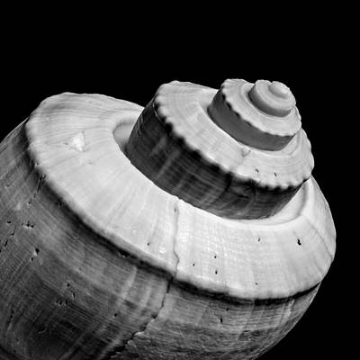

<!--  -->

 <h1>A Simple Unix Shell</h1>

<!--  -->

<br>

## Goal of Project
Th goal of this project is to implement a simple unix shell -- What is a unix shell? A Unix shell is a command-line interpreter or shell that provides a command line user interface for Unix-like operating systems.  The shell is both an interactive command language and a scripting language, and is used by the operating system to control the execution of the system using shell scripts.
Users typically interact with a Unix shell using a terminal emulator; however, direct operation via serial hardware connections or Secure Shell are common for server systems.  All Unix shells provide filename wildcarding, piping, here documents, command substitution, variables and control structures for condition-testing and iteration.[source: Wikipedia]

<br>

## Navigate README
* [Content of Repo](#navigate-repo)
* [General Information](#goal-of-project)
* [Technologies Used](#technologies-used)
* [Features](#features)
* [Setup](#how-to-setup)
* [Usage](#example-of-usage)
* [Author](#authors)
* [License](#license-&&-contribution)

<br>

## Navigate Repo

* [Man Page](https://github.com/stenwire/simple_shell/blob/master/man_1_simple_shell.man)
* [Checkout shell/linux memes](https://github.com/stenwire/simple_shell/tree/master/media/memes)
* [Header file](https://github.com/stenwire/simple_shell/blob/master/shell.h)
* [New environment file](https://github.com/stenwire/simple_shell/blob/master/new_environment.c)
* [File containing string functions](https://github.com/stenwire/simple_shell/blob/master/string_functions.c)

<br>

## Features

From the project instruction, we were asked to replicate some builtins you woul find in a normal unix shell, along with that we were also tasked with some features of the normal unix shell. Some of these builtins and features we weere able to replicate are highlighted in the table below and vice versa.

<br>

<table>
  <tr>
    <th></th>
    <th scope="col">Features</th>
    <th scope="col">Implemented</th>
  </tr>
  <tr>
    <td>1</td>
    <td>handles command line arguments</td>
    <td>-----YES</td>
  </tr>
  <tr>
    <td>2</td>
    <td>implements builtins</td>
    <td>-----YES</td>
  </tr>
  <tr>
    <td>3</td>
    <td>uses the PATH</td>
    <td>-----YES</td>
  </tr>
  <tr>
    <td>4</td>
    <td>uses exit status</td>
    <td>-----YES</td>
  </tr>
  <tr>
    <td>5</td>
    <td>shell continues upon Crtl+C (^C)</td>
    <td>-----YES</td>
  </tr>
  <tr>
    <td>6</td>
    <td>custom strtok function</td>
    <td>-----YES</td>
  </tr>
  <tr>
    <td>7</td>
    <td>handles comments (#)</td>
    <td>-----YES</td>
  </tr>
  <tr>
    <td>8</td>
    <td>handles ";"</td>
    <td>-----YES</td>
  </tr>
</table

<br>
  
<table>
  <tr>
    <th></th>
    <th scope="col">BUILTINS</th>
    <th scope="col">Implemented</th>
  </tr>

  <tr>
    <td>1</td>
    <td>exit</td>
    <td>-----YES</td>
  </tr>

  <tr>
    <td>2</td>
    <td>env</td>
    <td>-----YES</td>
  </tr>
    
  <tr>
    <td>3</td>
    <td>setenv</td>
    <td>-----YES</td>
  </tr>
  <tr>
    <td>4</td>
    <td>unsetenv</td>
    <td>-----YES</td>
  </tr>
</table

<br>

## Example of usage


<br>

## How to Setup

```
-----> Requirement
* Any Ubuntu distribution
* GCC installed (gcc 9.3.0)
----->
```

Follow below steps to setup locally:
* clone repo: ```git clone https://github.com/stenwire/simple_shell.git```
* change into repo: ```cd simple_shell```
* verify all files
* Compile: ```gcc -Wall -Werror -Wextra -pedantic *.c -o hsh```
* Run the shell in interactive mode: ```./hsh``` or run the shell in non-interactive mode: ```echo "pwd" | ./hsh ```

<br>

## Authors

<table>
<tr>
    <th>Stephen Nwankwo</th>
    <th>HARUNA BERIKISU</th>
</tr>
<tr>
    <td>
    <a href="https://www.linkedin.com/in/stephen-nwankwo-9876b4196">LinkedIn<a>
    </td>
    <td><a href="www.github.com/Becky1810">Github</a></td>
    <tr>
    <td><a href="www.twitter.com/Lord_Sten">Twitter</a></td>
    <td><a href="www.github.com/Becky1810">Nil</a></td>
    </tr>
</tr>
</table>

<br>

## License && Contribution

This project will bee made open source and can be freely contributed to from/after 19-05-2022, please checkout [Contribution guildline](https://github.com/stenwire/simple_shell.git/contributing.md)
